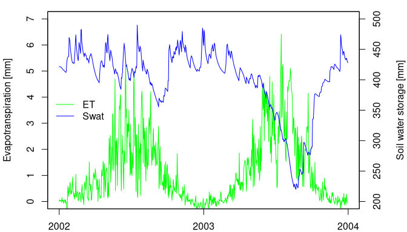

<!-- README.md is generated from README.Rmd. Please edit that file -->

# LWFBrook90R

<!-- badges: start -->

[](https://www.repostatus.org/#active)
[](https://travis-ci.com/pschmidtwalter/LWFBrook90R)
<!-- badges: end -->

`LWFBroo90R` provides an implementation of the Soil Vegetation
Atmosphere Transport (SVAT) model
[LWF-BROOK90](https://www.lwf.bayern.de/boden-klima/wasserhaushalt/index.php)
(Hammel & Kennel, 2001) written in Fortran. The model simulates daily
transpiration, interception, soil and snow evaporation, streamflow and
soil water fluxes through a soil profile covered with vegetation. A set
of high-level functions for model set up, execution and parallelization
provide easy access to plot-level SVAT simulations, as well as multi-run
and large-scale applications.

## Installation

You can install the released version of LWFBrook90R from
[CRAN](https://CRAN.R-project.org) with:

``` r
install.packages("LWFBrook90R")
```

and the development version can be installed from
[Github](https://github.com/pschmidtwalter/LWFBrook90R) using the
package `remotes`:

``` r
remotes::install_github(repo="pschmidtwalter/LWFBrook90R") 
```

## Usage

Below is basic example. For more complex examples take a look at the
packages vignettes with `browseVignettes("LWFBrook90R")`.

The main function `run_LWFB90()` creates the model input from model
control options, parameters, climate and soil data and returns the
simulation results.

``` r
# load package and sample data
library(LWFBrook90R)
data(slb1_meteo, slb1_soil)

# set up default model control options and parameters
opts <- set_optionsLWFB90()
parms <- set_paramLWFB90()

# Derive soil hydraulic properties from soil physical properties 
# using a pedotransfer function: 
soil <- cbind(slb1_soil, hydpar_wessolek_tab(texture = slb1_soil$texture))

# run the model and capture results
lwfb90_res <- run_LWFB90(options_b90 = opts,
                         param_b90 = parms,
                         climate = slb1_meteo,
                         soil = soil)

# View structure of result list object
str(lwfb90_res, max.level = 1)
```

Plot results

``` r
dates <- with(lwfb90_res$daily_output, as.Date(paste(yr, mo, da, sep = "-")))

oldpar <- par(no.readonly = TRUE)
plot(dates,lwfb90_res$daily_output$tran, 
     col = "green", type = 'l', ylim = c(0,5),
     xlab = "", ylab = "Transpiration [mm]")
par(new=TRUE)
plot(dates, lwfb90_res$daily_output$swat, type = "l", 
     col = "blue", ylim = c(200,500), 
     yaxt = "n", xaxt = "n", ylab = "", xlab = "")

axis(4,pretty(c(200,500)))
mtext("Soil water storage [mm]", side = 4, line =3)
legend("left", legend = c("tran", "swat"),
       col = c("green", "blue"),  lty = 1, 
       bty = "n")
```



``` r
par(oldpar)
```

## Citation

Schmidt-Walter, P., Trotsiuk, V., Meusburger, K., Zacios, M.,
Meesenburg, H. (2020): Advancing simulations of water fluxes, soil
moisture and drought stress by using the LWF-Brook90 hydrological model
in R. Agr. For. Met. 291, 108023.
<https://doi.org/10.1016/j.agrformet.2020.108023>

## Contributions

Implementations of further methods for creating model input (e.g. leaf
area dynamics, root depth density distributions, pedotransfer functions)
and other improvements are highly welcome.

## Authors

Paul Schmidt-Walter, Volodymyr Trotsiuk, Klaus Hammel, Martin Kennel,
Tony Federer.

Tony Federer’s original
[Brook90](http://www.ecoshift.net/brook/b90doc.html) Fortran 77 code
(Brook90\_v3.1F, License: CC0) was enhanced by Klaus Hammel and Martin
Kennel at Bavarian State Institute of Forestry (LWF) around the year
2000. Since then, LWF-BROOK90 is distributed by
[LWF](https://www.lwf.bayern.de/boden-klima/wasserhaushalt/index.php)
upon request as a pre-compiled Fortran command line program together
with an MS Access User Interface. In 2019, Volodymyr Trotsiuk converted
the Fortran 77 code to Fortran 95 and implemented the connection to R.
Paul Schmidt-Walter’s `brook90r` (Schmidt-Walter, 2018) package for
LWF-Brook90 input data generation, model execution and result processing
was adapted and extended to control this interface function.

## License

GPL-3 for all Fortran and R code. `brook90r` has GPL-3, while
LWF-Brook90 was without license until recently. Lothar Zimmermann and
Stephan Raspe (LWF), as well as all Fortran contributors agreed to
assign GPL-3 to the Fortran code.

## References

Federer C.A. (2002): BROOK 90: A simulation model output for
evaporation, soil water, and streamflow.
<http://www.ecoshift.net/brook/brook90.htm>

Federer C.A., Vörösmarty, C., Fekete, B. (2003): Sensitivity of Annual
Evaporation to Soil and Root Properties in Two Models of Contrasting
Complexity. J. Hydrometeorol. 4, 1276–1290.
<https://doi.org/10.1175/1525-7541(2003)004%3C1276:SOAETS%3E2.0.CO;2>

Hammel, K., Kennel, M. (2001): Charakterisierung und Analyse der
Wasserverfügbarkeit und des Wasserhaushalts von Waldstandorten in Bayern
mit dem Simulationsmodell BROOK90. Forstliche Forschungsberichte München
185. ISBN 978-3-933506-16-0

Schmidt-Walter, P. (2018). brook90r: Run the LWF-BROOK90 hydrological
model from within R (Version v1.0.1). Zenodo.
<http://doi.org/10.5281/zenodo.1433677>
